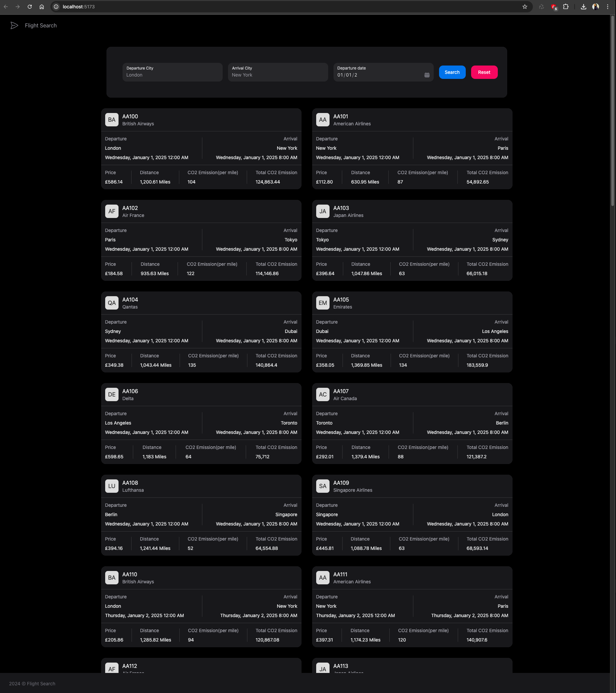
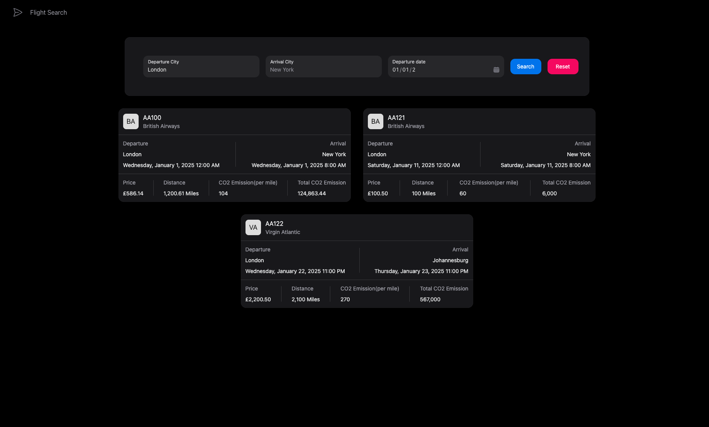
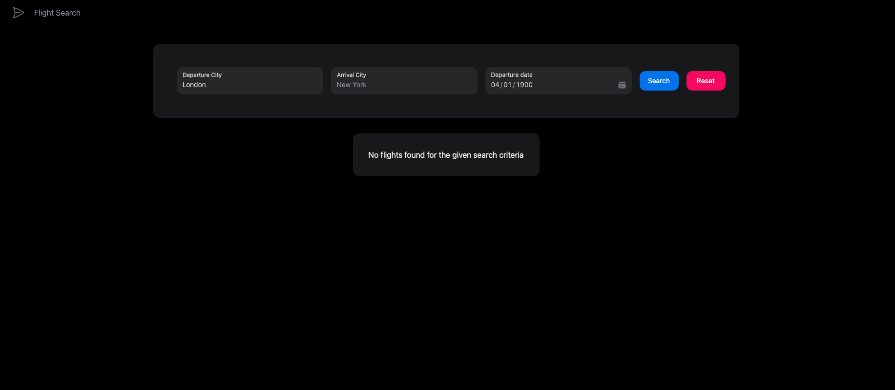
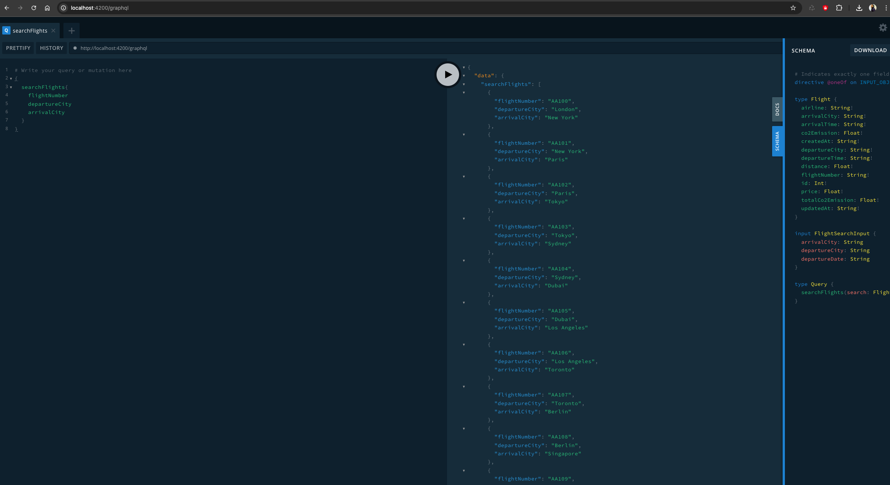

# Flight Search API

## Overview

The Flight Search API is an application that lets users search for flights for multiple passengers and calculates CO2 emissions for each passenger. It is designed with modern web technologies like **Node.js**, **NestJS**, **React**, **Redis**, **PostgreSQL**, **Docker**, and **Apollo GraphQL** to provide a robust and efficient flight search solution.

The API provides a structured way to search for flights based on specific filters and also calculates the environmental impact (in terms of CO2 emissions) of the chosen flights.

---

## Features

### Flight Search:
- Users can search for flights using the following filters:
   - Departure city
   - Arrival city
   - Departure date

### Detailed Flight Information:
- The search results include:
   - Flight number
   - Airline name
   - Departure and arrival times
   - Ticket price
   - CO2 emissions for the flight

### Smart Calculations:
- Calculates CO2 emissions based on the distance of each flight.

### Error Handling:
- The system gracefully handles common edge cases like:
   - No flights found for the given criteria.
   - Invalid or incomplete input data (e.g., missing dates).

### Performance Optimization:
- **Caching**: Uses **Redis** to store frequently used data (like search results) to improve response time and reduce the load on the database.

### Logging and Error Management:
- Provides basic logging and error handling to identify and resolve issues quickly.

### Frontend Application:
- A simple **React** web app allows users to search for flights and view results with an easy-to-use interface.

---

## System Design

### Architecture
The system is built around the following key components:

#### 1. **Backend**
- Developed with **Node.js** and **NestJS**.
- Uses **Apollo GraphQL** to handle API queries and mutations efficiently.
- Performs the CO2 emissions calculations.
- Retrieves and manipulates flight data stored in the database.

#### 2. **Frontend**
- A user interface built with **React**, utilizing modern libraries like **Tailwind CSS** and **NextUI** for a clean and responsive design.

#### 3. **Database**
- **PostgreSQL** is used to store all flight-related data, such as:
   - Flight numbers
   - Departure and arrival cities
   - Timings, ticket prices, distances, and CO2 emissions

#### 4. **Cache**
- **Redis** is used to cache search results, minimizing repeated database queries and improving the system's speed.

#### 5. **Testing**
- The application is thoroughly tested using **Jest** and **Supertest** to ensure the backend functions correctly.

#### 6. **Deployment**
- The system is containerized using **Docker**, making it easy to deploy and scale in cloud environments like AWS (using ECS or EKS).

---

## Installation and Setup

### Requirements
Before you begin, make sure the following are installed:
- **Node.js**
- **Docker**
- **PostgreSQL**
- **Redis**

### Step-by-Step Guide

1. Clone the project repository:
   ```sh
   git clone https://github.com/prashanthjs/flight-search.git
   cd flight-search-api
   ```

2. Start the backend services, PostgreSQL, and Redis using Docker:
   ```sh
   docker-compose up -d
   ```

3. Install backend dependencies:
   ```sh
   cd flights-search
   npm install
   ```

4. Copy the example environment file and update it with your database details:
   ```sh
   cp .env.example .env
   ```

5. Update the database schema:
   ```sh
   npm run schema:update
   ```

6. Add sample flight data to the database:
   ```sh
   npm run seed
   ```

7. Run the backend server in development mode:
   ```sh
   npm run start:dev
   ```
   The backend server will be available at: **http://localhost:42000/graphql**

8. Run unit tests:
   ```sh
   npm run test
   ```

9. Set up the frontend:
   ```sh
   cd ../flights-search/flights-search-frontend
   npm install
   npm run dev
   ```
   The frontend server will be available at: **http://localhost:5173**

---

## Design Decisions

### Why These Technologies Were Chosen:
- **Database (PostgreSQL)**:
   - Excellent for handling relational data and supports strong transactional features.

- **Caching (Redis)**:
   - Boosts performance by caching results of frequently made queries.
   - Reduces the load on the PostgreSQL database.

- **Containerization (Docker)**:
   - Simplifies deployment and makes the system portable.
   - Allows scaling individual services independently.

- **Testing (Jest)**:
   - Ensures each part of the system functions as expected.

---

## Future Improvements

1. **Flight Search Enhancements**:
   - Add **pagination** to manage a large number of search results more effectively.

2. **Integration with Live Flight Data APIs**:
   - Use real-time APIs to fetch up-to-date flight information.

3. **User Management**:
   - Implement user authentication and account features.

4. **Database Optimization**:
   - Split the flight information table into multiple related tables to improve performance and enforce normalization.

---

## Screenshots

[](https://github.com/prashanthjs/flight-search/tree/main/screenshots/frontend-1.png)
[](https://github.com/prashanthjs/flight-search/tree/main/screenshots/frontend-2.png)
[](https://github.com/prashanthjs/flight-search/tree/main/screenshots/frontend-3.png)
[](https://github.com/prashanthjs/flight-search/tree/main/screenshots/server-playground.png)

---

## Conclusion

The Flight Search API is a feature-rich, modern solution designed for efficient flight searching and CO2 emissions calculations. With its robust architecture, performance optimizations, and easy deployment, it serves as a strong foundation for building scalable, real-world applications in the travel domain.  
